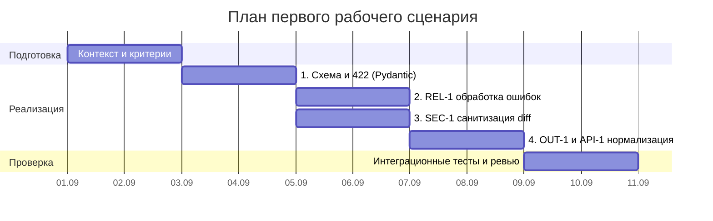

# План поставки

## Инкременты и ответственность

| Инкремент | Наблюдаемый результат (DoD) | Что делает человек | Что делает AI или субагент | Проверка | Зависимости |
|---|---|---|---|---|---|
| 1. Схема и 422 | Входной payload валидируется через `ReviewRequest`; пустой ввод или невалидный тип возвращает HTTP 422 | Интеграция Pydantic-модели в эндпоинт `/api/reviews`, настройка статус-кодов | Генерация полей Pydantic-схемы и валидаторов строк | `pytest tests/test_api.py -k test_empty_payload_422` | — |
| 2. REL-1 | Внешний вызов LLM ограничен таймаутом 10с; исключения маппятся в контролируемый ответ (HTTP 502/504) | Настройка клиента с таймаутом, реализация exception handling и fallback | Генерация обработчиков исключений и моков сетевых сбоев | `pytest tests/test_review_service.py -k test_llm_timeout_handled` | 1 |
| 3. SEC-1 | Из `diff` перед отправкой в LLM удаляются токены, пароли и приватные ключи с заменой на `[REDACTED]` | Реализация функции `sanitize()`, ревью регулярных выражений и правил | Генерация шаблонов поиска секретов (API keys, tokens, bearer) | `pytest tests/test_security.py -k test_sanitize_secrets` | 1 |
| 4. OUT-1 и API-1 | Отклонение diff > 20k символов (HTTP 413); нормализация ответа в контракт `{summary, risks<=3, checks}` | Реализация проверки длины в middleware/эндпоинте и схемы ответа | Генерация Pydantic-модели `ReviewResponse` и логики нормализации рисков | `pytest tests/test_api.py -k test_payload_too_large_and_format` | 1–3 |

## Диаграмма Ганта

## Как использовали AI

- Для чего: Разбивка на инкременты, роли и проверки; исправление разорванного критического пути диаграммы Ганта.
- Тип промпта: few-shot (в рамках Практики 2) / master prompt (в Практике 1).
- Строка в [`prompts.md`](prompts.md): P1-02 (первичная версия); Практика 2: [`few_shot/experiment.md`](../practice_02/few_shot/experiment.md).
- Что проверили и исправили сами: Устранили висячую задачу без ID в диаграмме Ганта, выровняли зависимости инкремента 4 от инкрементов 2 и 3 (`after a3 a4`), удалили неиспользованный шаблонный текст, детализировали DoD для каждого этапа.
