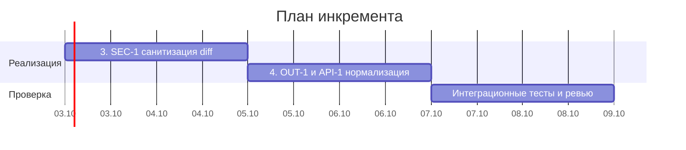
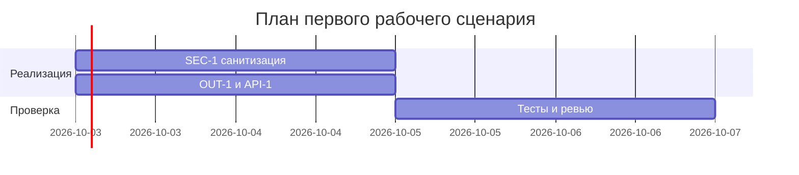
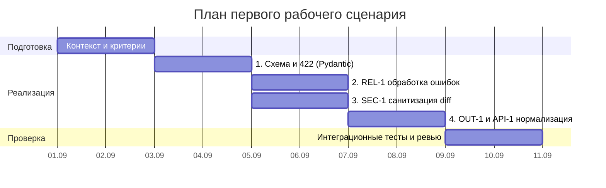

# Few-shot

- Артефакт Практики 1: [`practices/practice_01/project_management.md`](../../practice_01/project_management.md) (разделы «Инкременты и ответственность» и «Диаграмма Ганта»)
- Что хотим улучшить: Устранить разрыв зависимостей задач в диаграмме Ганта (висящая задача без ID и без `after`), ликвидировать неудалённый текст-заглушку («Замените даты и задачи на свой план.»), конкретизировать Definition of Done (DoD) инкрементов и строго разграничить роли Человек/AI.

## Примеры

### Хороший результат

```markdown
| Инкремент | Наблюдаемый результат (DoD) | Что делает человек | Что делает AI или субагент | Проверка | Зависимости |
|---|---|---|---|---|---|
| 3. SEC-1 | Из diff перед отправкой в LLM удаляются токены/секреты с заменой на `[REDACTED]` | Реализация `sanitize()`, ревью правил маскирования | Генерация регулярных выражений поиска токенов и секретов | `pytest tests/test_security.py -k test_sanitize_secrets` | 1 |


*Характеристики хорошего результата:* У каждой задачи есть ID, этап проверки жестко завязан на завершение реализации (`after a5`), DoD сформулирован измеримо со ссылкой на автоматический тест, разделение ролей четко зафиксировано.*

### Плохой результат

```markdown
| Инкремент | Наблюдаемый результат | Что делает человек | Что делает AI или субагент | Проверка | Зависимости |
|---|---|---|---|---|---|
| 3. Безопасность | Сделать безопасность | Проверить | Написать код | Тесты | — |


Замените даты и задачи на свой план.

*Ошибки плохого результата:* Размытый DoD без критериев («сделать безопасность»), задача «Тесты и ревью» не имеет ID и зависимости `after` (в Mermaid начнет выполняться с первого дня проекта параллельно с подготовкой), задача `a5` игнорирует зависимость от `a4`, оставлена шаблонная фраза.*

## Запрос

```text
Вы — Lead Release Engineer и AI-архитектор процессов.
Используя технику Few-Shot и ориентируясь на Хороший и Плохой примеры выше, переработайте артефакт `practices/practice_01/project_management.md`:
1. Устраните разрыв критического пути в диаграмме Ганта: свяжите задачу тестов с финишем реализаций и обеспечьте зависимость задачи 4 от инкрементов 2 и 3.
2. Детализируйте таблицу инкрементов: добавьте наблюдаемый результат (DoD), конкретизируйте обязанности человека и AI, привяжите проверку к тестам.
3. Удалите шаблонный текст-плейсхолдер.
4. Сохраните соответствие правилам CASE.md: SEC-1, API-1, REL-1, OUT-1.
```

## Что получили

```markdown
| Инкремент | Наблюдаемый результат (DoD) | Что делает человек | Что делает AI или субагент | Проверка | Зависимости |
|---|---|---|---|---|---|
| 1. Схема и 422 | Входной payload валидируется через ReviewRequest; пустой ввод или невалидный тип возвращает HTTP 422 | Интеграция Pydantic-модели в эндпоинт /api/reviews, настройка статус-кодов | Генерация полей Pydantic-схемы и валидаторов строк | pytest tests/test_api.py -k test_empty_payload_422 | — |
| 2. REL-1 | Внешний вызов LLM ограничен таймаутом 10с; исключения маппятся в контролируемый ответ (HTTP 502/504) | Настройка клиента с таймаутом, реализация exception handling и fallback | Генерация обработчиков исключений и моков сетевых сбоев | pytest tests/test_review_service.py -k test_llm_timeout_handled | 1 |
| 3. SEC-1 | Из diff перед отправкой в LLM удаляются токены, пароли и приватные ключи с заменой на [REDACTED] | Реализация функции sanitize(), ревью регулярных выражений и правил | Генерация шаблонов поиска секретов (API keys, tokens, bearer) | pytest tests/test_security.py -k test_sanitize_secrets | 1 |
| 4. OUT-1 и API-1 | Отклонение diff > 20k символов (HTTP 413); нормализация ответа в контракт {summary, risks<=3, checks} | Реализация проверки длины в middleware/эндпоинте и схемы ответа | Генерация Pydantic-модели ReviewResponse и логики нормализации рисков | pytest tests/test_api.py -k test_payload_too_large_and_format | 1–3 |


```

## Что изменили в исходном артефакте

- Файл и раздел: [`practices/practice_01/project_management.md`](../../practice_01/project_management.md), разделы `## Инкременты и ответственность` и `## Диаграмма Ганта`.
- Изменение: Добавлены четкие измеримые формулировки DoD и роли Человек/AI для всех 4 инкрементов; в диаграмму Ганта добавлен ID `:a6` и зависимость `after a5` для этапа «Интеграционные тесты и ревью», для задачи `a5` зафиксирована зависимость от `a3` и `a4` (`after a3 a4`); удалена строка-заглушка «Замените даты и задачи на свой план.».
- Как проверили: Выполнен запуск `make step1` (успешно, статус OK), проверена корректность рендеринга Mermaid-диаграммы и согласованность графа зависимостей с правилами `CASE.md` (API-1, SEC-1, REL-1, OUT-1).
- Что отклонили: Предложение агента добавить внешние инфраструктурные этапы (деплой в Kubernetes, настройку GitHub Actions CI), так как сервис находится на этапе первого локального сценария и это ограничено правилом SCOPE-1.
